# Solstice — Business Management Platform

A full-stack, multi-tenant business management platform: role-based team hierarchies, task delegation with proof-of-completion uploads, company/department/DM chat with realtime delivery, performance reviews, and subscription billing. Built as a production web app (Next.js) and companion mobile app (Expo/React Native) sharing one Express + PostgreSQL API.

**🔗 Live demo: [full-stack-business-management-app.vercel.app](https://full-stack-business-management-web.vercel.app)**

📄 [Product description](docs/PRODUCT.md) · 🧰 [Tech stack](docs/TECH_STACK.md) · 🔄 [Workflow](docs/WORKFLOW.md)

## The problem this solves

Most small-to-mid-size companies run their internal operations across tools that were never built for a real chain of command: a flat to-do list app that can't tell a manager from an intern, a group chat with no link back to actual work, a spreadsheet tracking "who's supposed to be doing what" that's out of date within a week. Task completion becomes a matter of trust — someone says it's done, and that's the end of the record.

Solstice is built around one idea instead: **an org chart is the access-control model, not just a directory.** Every person has a rank (Owner → Director → Manager → Project Head → Employee), and every action in the system — who you can hire into your team, who you can hand a task to, who can see what — is derived from that rank and enforced by the API itself, not just hidden behind a UI. On top of that, finishing a task is a deliberate, auditable act: a required description of how it was done, and — for tasks that need it — an actual uploaded document as evidence, not a checkbox anyone can silently tick.

The result is one tool that replaces the task tracker, the team directory, the internal chat, and the completion-accountability gap between them — purpose-built for how a company's reporting line actually works, not retrofitted onto a generic Kanban board.

## Screenshots

| | |
|---|---|
| **Sign in** — Google OAuth or email/password | **Select a business** — switch between companies you belong to |
| 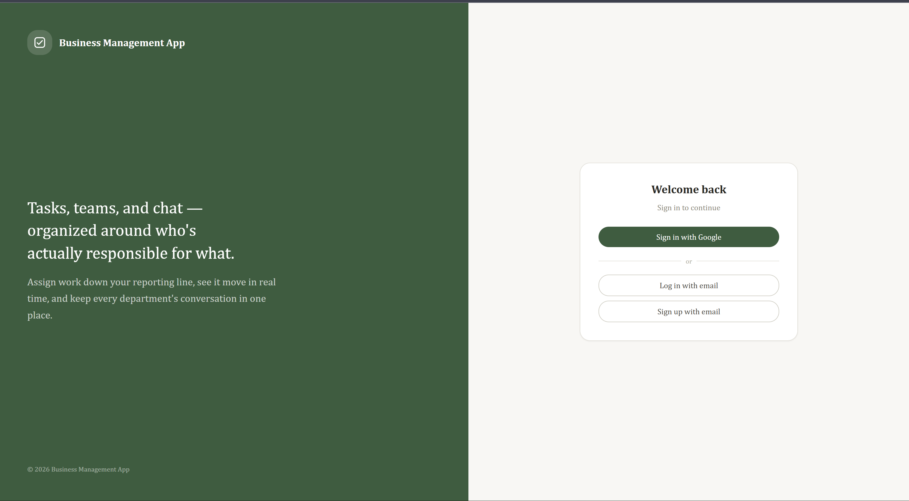 | 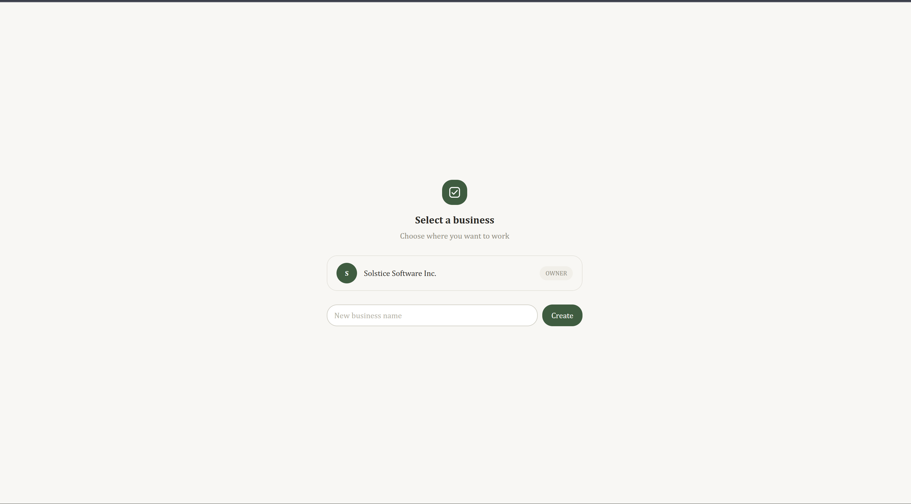 |
| **Dashboard** — live task/completion stats, team workload, who's completing the most | **Task board** — Kanban view scoped to what you created or were assigned |
| 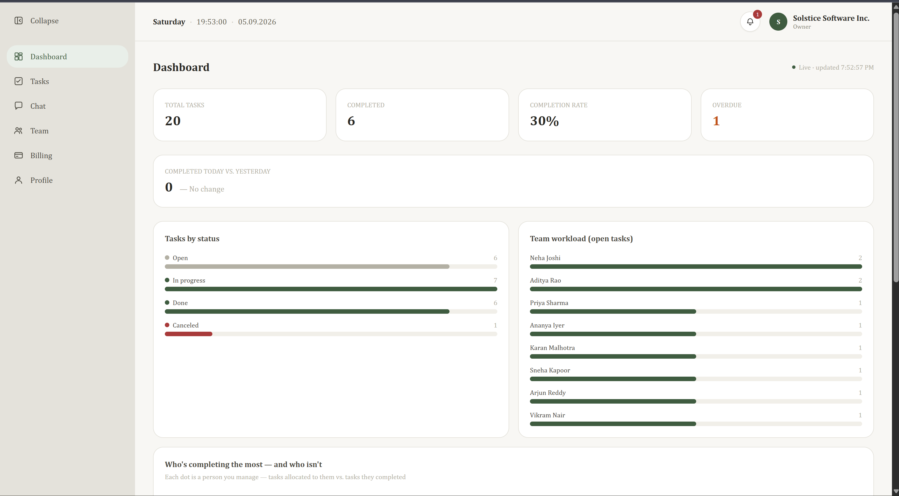 | 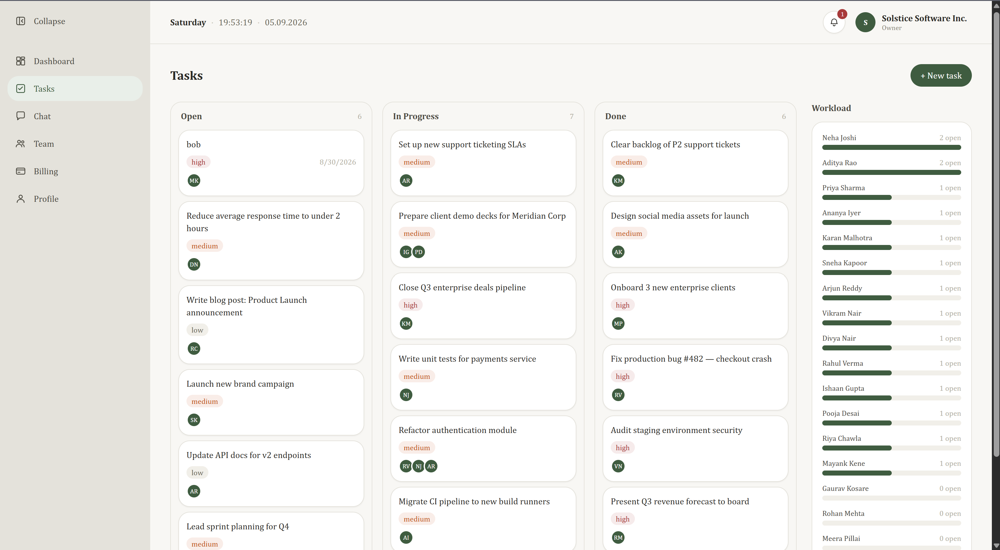 |
| **Chat** — auto-managed company/department channels plus ad-hoc project channels | **Team** — full org directory with role, department, and invite-by-email |
| 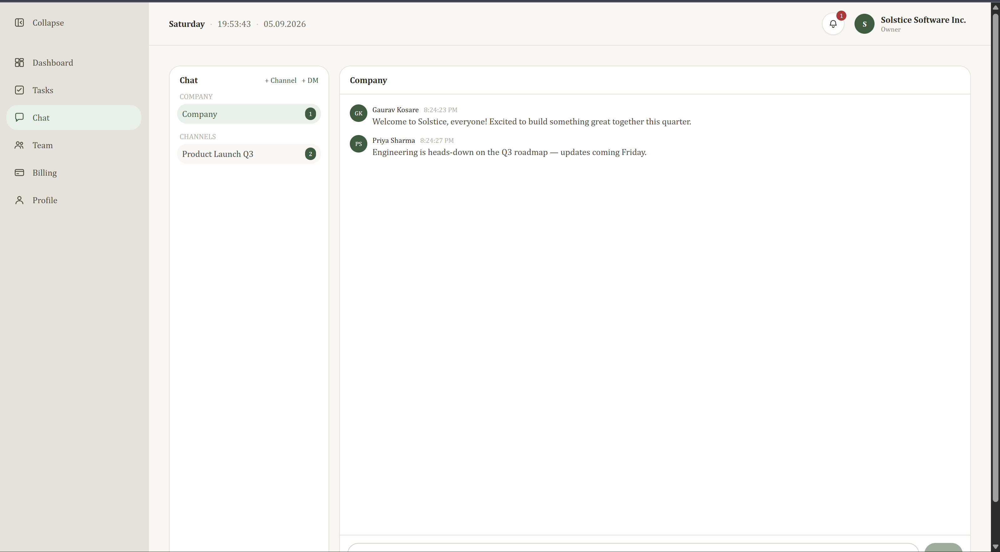 | 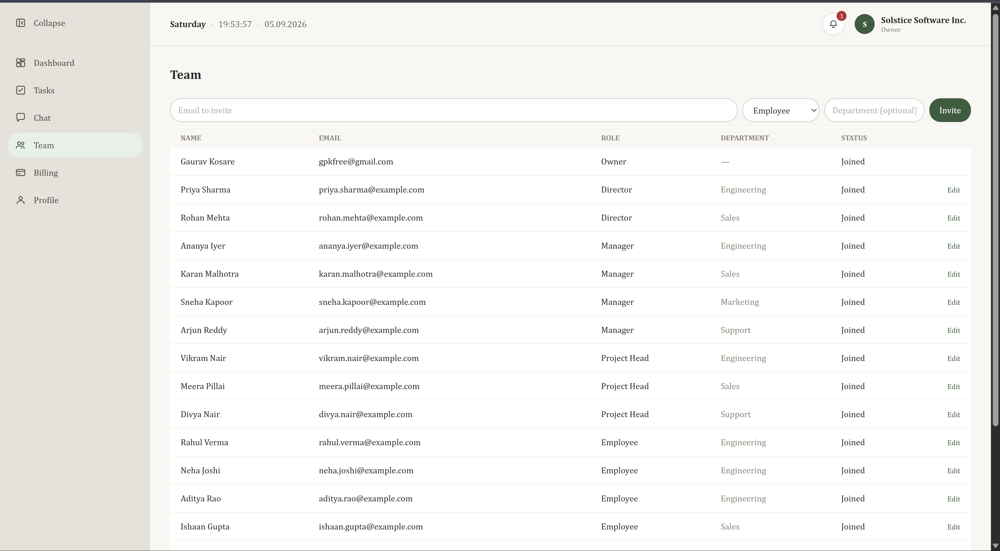 |
| **Profile** — linked auth methods, business membership, recent activity | **Billing** — Pro/Enterprise subscription plans |
| 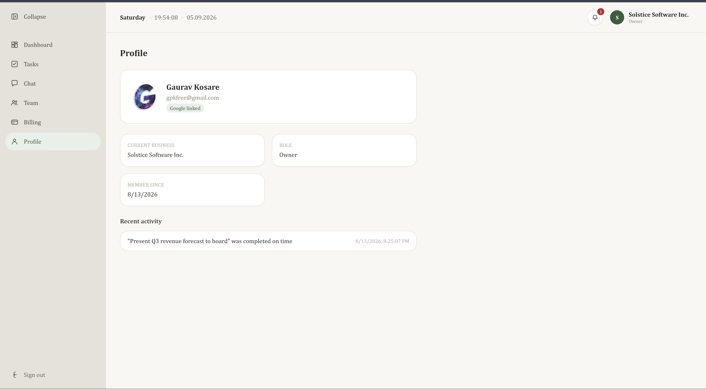 | 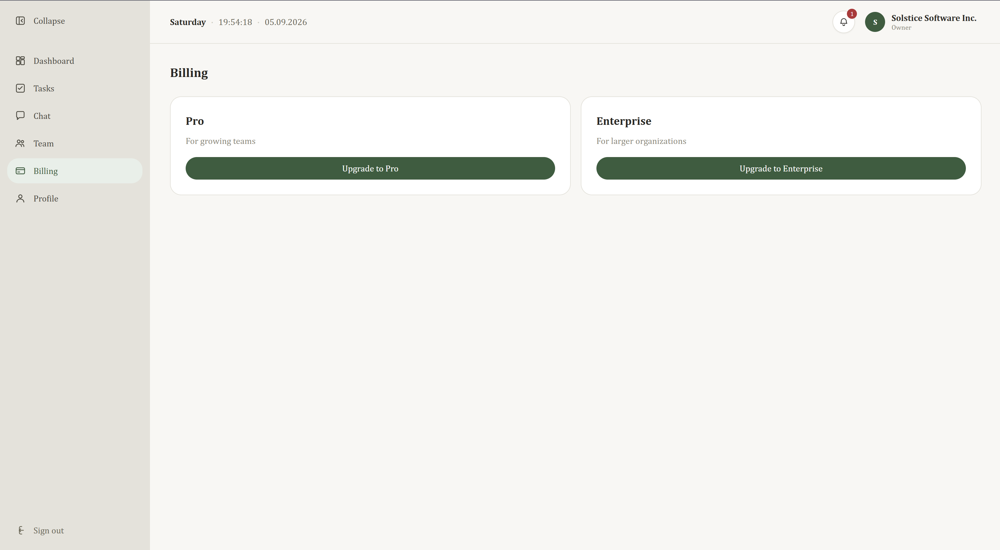 |

## Try it live

Sign in with Google, or explore a fully-seeded demo company — an owner, 2 directors, 4 managers, 3 project heads, 8 employees, 4 departments, 6 chat channels, and 19 tasks in various states (including uploaded proof-of-completion documents) — using any of these accounts:

| Email | Role | Password |
|---|---|---|
| `priya.sharma@example.com` | Director, Engineering | `Solstice#Demo2026` |
| `karan.malhotra@example.com` | Manager, Sales | `Solstice#Demo2026` |
| `vikram.nair@example.com` | Project Head, Engineering | `Solstice#Demo2026` |
| `rahul.verma@example.com` | Employee, Engineering | `Solstice#Demo2026` |

Every seeded account uses the same password — sign in as different roles to see how visibility and permissions change across the org chart (see [PRODUCT.md](docs/PRODUCT.md) for how the role hierarchy works).

## What it does

- **Role-based org hierarchy** — Owner → Director → Manager → Project Head → Employee. Every action (inviting a member, assigning a task, creating a channel) is authorized against this rank, enforced server-side, not just hidden in the UI.
- **Task delegation with proof of completion** — tasks can require a signed-off completion: a short description, and optionally a document (PDF, Office file, image — never video, capped at 5MB) uploaded directly to private object storage via short-lived signed URLs.
- **Team chat** — auto-managed company and department channels, ad-hoc custom channels, and 1:1 DMs, with realtime message delivery.
- **Performance reviews, billing & invoicing** — Razorpay-backed subscriptions, invoice history, and structured performance reviews tied to task completion/on-time rates.
- **Google OAuth + email/password auth**, shared across both the web and mobile clients through the same JWT-based API.

Full product description: [docs/PRODUCT.md](docs/PRODUCT.md).

## Architecture

```
web/     Next.js 15 (React 19) — the primary web client
mobile/  Expo / React Native — companion mobile client
api/     Express + TypeScript — REST API shared by both clients
```

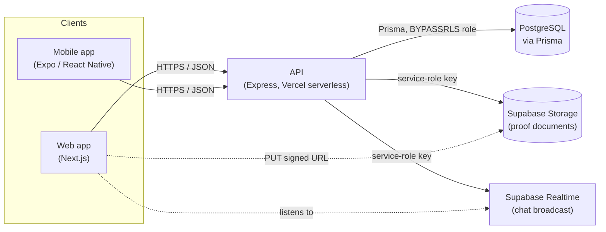

Both clients talk to the **same** Express API — there's no client-specific backend logic. The API is the only thing that ever holds the Supabase service-role key or a direct database credential; the clients only ever hold a public anon key, used solely for realtime listening and pre-signed file PUTs.

- **Database:** PostgreSQL (Supabase), accessed via Prisma migrations. Row Level Security is enabled with a default-deny policy on every table — the API's database role bypasses RLS, so a leaked/extracted public client key can't read or write anything directly.
- **File storage:** Supabase Storage, private bucket, enforced at three independent layers (client validation, server validation, bucket-level size/MIME allowlist) — client uploads go straight to signed URLs, never through the API's own request body.
- **Realtime:** Supabase Broadcast for live chat delivery, with polling as an automatic fallback.
- **Auth:** Google OAuth2 and email/password, both exchanged for a short-lived JWT via a one-time-code handshake — no long-lived tokens ever touch a URL or browser history.
- **Deployment:** Vercel (web + API as separate projects/serverless functions), Supabase (Postgres, Storage, Realtime) — entirely on free tiers.

## Workflows

### Organization hierarchy

Every action — inviting someone, assigning a task, adding someone to a channel — is authorized against this delegation chain, enforced in the API, not just the UI:

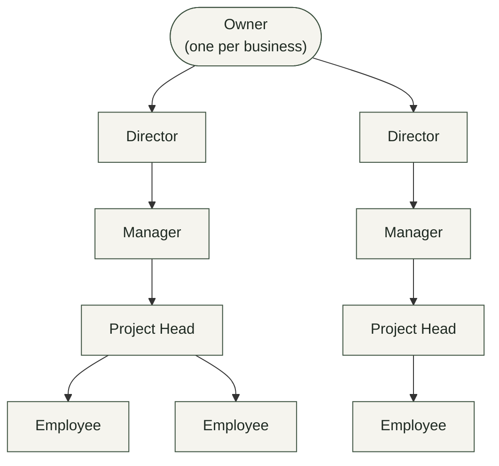

*You may only invite, assign tasks to, or otherwise act on people strictly below your own rank — a Manager can bring on a Project Head or Employee, never another Manager, a Director, or the Owner.*

### Sign-in flow

A long-lived JWT is never put in a redirect URL — a single-use, 60-second code is exchanged for it over a direct HTTPS call instead:

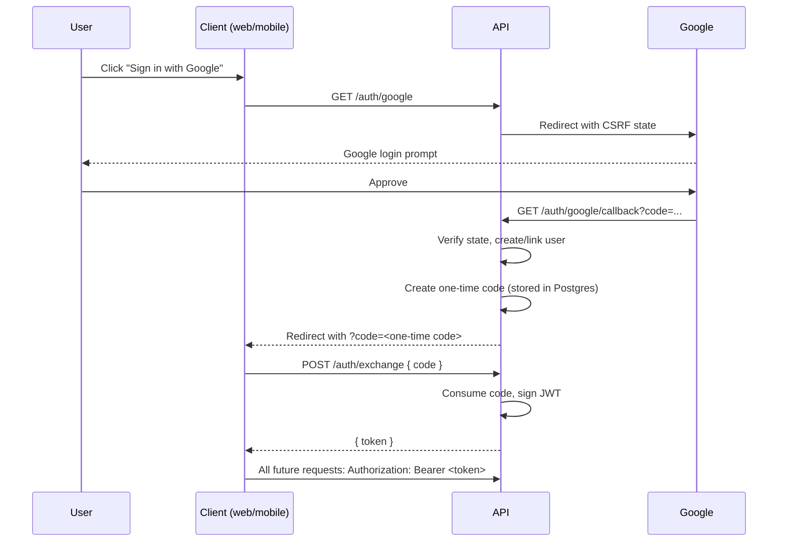

### Task completion (proof of work)

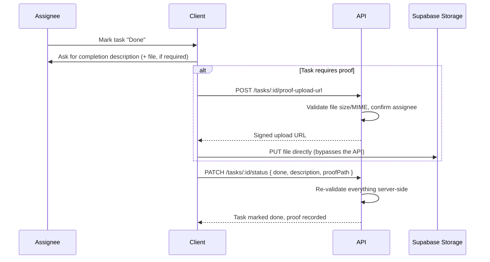

Full request/auth/deploy flow diagrams and dev workflow: [docs/WORKFLOW.md](docs/WORKFLOW.md).

## Tech stack

**Frontend:** Next.js, React, TypeScript, Tailwind CSS
**Mobile:** Expo, React Native, NativeWind
**Backend:** Node.js, Express, TypeScript, Prisma, Zod
**Data & infra:** PostgreSQL, Supabase (Storage/Realtime), Vercel
**Integrations:** Google OAuth2, Razorpay (billing), Brevo (transactional email)

Full breakdown with rationale: [docs/TECH_STACK.md](docs/TECH_STACK.md).

## Getting started

### Prerequisites

- Node.js 20+ and npm
- A free [Supabase](https://supabase.com/) project (Postgres + Storage + Realtime)
- (Optional) A [Google Cloud OAuth2 client](https://console.cloud.google.com/apis/credentials) for "Sign in with Google"
- (Optional) [Razorpay](https://razorpay.com/) test-mode keys for billing, and a [Brevo](https://www.brevo.com/) API key for invite emails

Nothing above marked optional is required to run the app — every integration degrades gracefully when unconfigured (see the table under [Environment variables](#2-configure-environment-variables)).

### 1. Clone and install

```bash
git clone https://github.com/GauravKosare/Full-Stack-Business-Management-App.git
cd Full-Stack-Business-Management-App
npm install
```

This is an npm workspaces monorepo — one install at the root pulls dependencies for `api/`, `web/`, and `mobile/` together.

### 2. Configure environment variables

Copy each example file and fill it in:

```bash
cp api/.env.example api/.env
cp web/.env.local.example web/.env.local
cp mobile/.env.example mobile/.env
```

#### `api/.env`

| Variable | Required? | What it's for |
|---|---|---|
| `DATABASE_URL` | **Yes** | Postgres connection string (Supabase project connection string works directly) |
| `JWT_SECRET` | **Yes** | Long random string used to sign auth tokens |
| `NODE_ENV`, `PORT` | Yes (has sane defaults) | Standard Express config |
| `GOOGLE_CLIENT_ID` / `GOOGLE_CLIENT_SECRET` / `GOOGLE_CALLBACK_URL` | Optional | Enables "Sign in with Google"; without these, email/password auth still works |
| `MOBILE_AUTH_REDIRECT_URL` | Optional | Custom URL scheme (`myapp://auth`) the mobile app is redirected back to after Google sign-in |
| `WEB_APP_URL` | Optional | Where the web app is hosted — required for the web OAuth redirect to resolve correctly in production |
| `SUPABASE_URL` + `SUPABASE_SERVICE_ROLE_KEY` | Optional (shared by two features) | Powers **both** realtime chat broadcast **and** task-completion proof file uploads. Without them, chat falls back to polling and the proof-upload endpoint returns `501`. Get the service role key from Supabase → Project Settings → API → `service_role` (**secret — never expose client-side**) |
| `BREVO_API_KEY` / `BREVO_SENDER_EMAIL` / `BREVO_SENDER_NAME` | Optional | Sends real invite emails; without a key, invites still work, just silently skip the email |
| `RAZORPAY_KEY_ID` / `RAZORPAY_KEY_SECRET` / `RAZORPAY_WEBHOOK_SECRET` / `RAZORPAY_PLAN_PRO` / `RAZORPAY_PLAN_ENTERPRISE` | Optional | Billing/subscriptions; billing routes return `501` if unconfigured |
| `APP_URL`, `LOG_LEVEL` | Optional | Misc server config |

#### `web/.env.local`

| Variable | Required? | What it's for |
|---|---|---|
| `NEXT_PUBLIC_API_URL` | **Yes** | Base URL of the API (e.g. `http://localhost:3000` locally) |
| `NEXT_PUBLIC_SUPABASE_URL` / `NEXT_PUBLIC_SUPABASE_ANON_KEY` | Optional | Only needed to override the built-in fallback if you're pointing the web app at your own Supabase project — the anon key is safe to expose client-side by design (it authorizes nothing on its own; see the RLS note above) |

#### `mobile/.env`

| Variable | Required? | What it's for |
|---|---|---|
| `EXPO_PUBLIC_API_URL` | **Yes** | Base URL of the API. Use `http://10.0.2.2:3000` for the Android emulator talking to a host-machine API, or your machine's LAN IP for a physical device |

### 3. Set up the database

```bash
npm run prisma:migrate --workspace api   # applies all migrations to DATABASE_URL
npm run prisma:generate --workspace api  # regenerates the Prisma client (also runs automatically on install)
```

### 4. Run it

```bash
npm run dev --workspace api      # API on http://localhost:3000
npm run dev --workspace web      # Web app on http://localhost:3001
npm run start --workspace mobile # Expo dev server (scan the QR code with Expo Go)
```

## Deployment

The live demo runs entirely on free tiers: **Vercel** (web + API) and **Supabase** (Postgres, Storage, Realtime).

1. **Database:** create a Supabase project, then run `npx prisma migrate deploy` (from `api/`, with `DATABASE_URL` pointed at that project) to apply all migrations.
2. **API:** create a Vercel project with **`api/`** as the root directory. It deploys as a serverless function via `api/api/index.ts` (routed through `api/vercel.json`'s catch-all rewrite) and runs `prisma generate` as its build step (`vercel-build` in `api/package.json`). Set all the `api/.env` variables above as Vercel environment variables.
3. **Web:** create a second Vercel project with **`web/`** as the root directory. Set `NEXT_PUBLIC_API_URL` to the deployed API's URL.
4. Set `WEB_APP_URL` on the **API** project to the deployed web app's URL (needed for the OAuth redirect to resolve), and set `GOOGLE_CALLBACK_URL` in your Google OAuth client config to `<api-url>/api/v1/auth/google/callback`.
5. After deploying, hit `GET <api-url>/health` — it returns which optional integrations (`google`, `brevo`, `razorpay`, `realtime`, `storage`) are actually active on that deployment, the fastest way to confirm an environment variable landed correctly.

Full deploy/request-flow walkthrough: [docs/WORKFLOW.md](docs/WORKFLOW.md#cideploy-workflow).

## Documentation

- [docs/PRODUCT.md](docs/PRODUCT.md) — what the product is, who it's for, the role hierarchy, and the design philosophy behind it
- [docs/TECH_STACK.md](docs/TECH_STACK.md) — every technology used and why
- [docs/WORKFLOW.md](docs/WORKFLOW.md) — request flow, auth flow, task-completion flow, and the dev/deploy workflow
